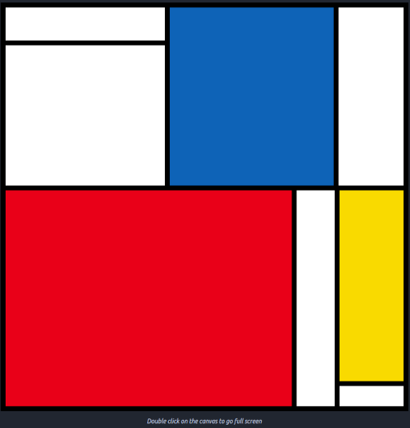
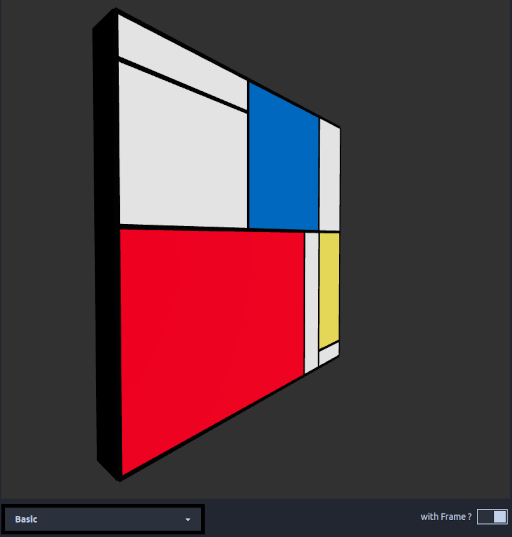

# Mondrian verse

Mondrian generator on both 2d and 3d.

## Example
- 2D

- 3D

## Inspirations

https://www.re-thinkingthefuture.com/architects-lounge/a447-mondrian-inspired-plugin-by-wesearch-lab/
https://sketchfab.com/3d-models/collage-frame-bd89ce9c064949048fa29c93f012129a

https://github.com/JEFworks/mondrian-generator
https://inventwithpython.com/bigbookpython/project47.html
https://reactfordataviz.com/articles/mondrian-art-generator/
https://mondrian-generator.swizec-react-dataviz.vercel.app/
